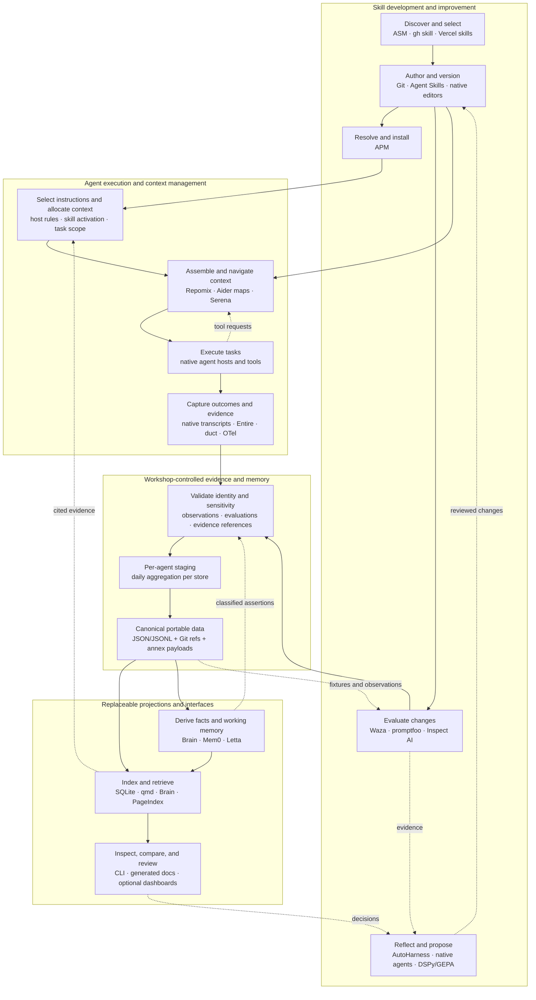

# Workshop and agent context: scope, choices, and assessment ledger

Review date: **2026-10-01**.
This is a bounded, cumulative architectural review, not an exhaustive catalog or a plan to install every named tool.
The map covers the surrounding stack; Workshop coordinates only the durable cross-project knowledge and decisions that existing tools do not already own.

## Decisions and current implementation

**Own the records; compose the tools.** Source identities, exact artifact revisions, original evidence, classifications, evaluation conditions, and human decisions must survive replacement of any collector, runner, index, or UI.
Adapters preserve native output alongside normalized fields rather than making lossy conversion the only surviving evidence.
Sensitivity governs derived indexes and context packets as well as original records.

Current project-native skills and APM dependency management remain in place.
The recorder and private overlay stage outside the checkout. The repository `memory/` directory was retired on October 2 after lossless migration and remote recovery verification. Curated v0 commands use an external working copy with compact annex snapshots; assessment publication retains the daily 1000-record batch boundary. See [recovery details](memory-collection.md#retiring-the-repository-memory-directory).
The implemented transitional storage path uses per-agent staging, aggregation across agents once daily per store, 1,000-record durable batches plus at most one daily remainder, annex payloads, and independent Git refs.
The October 2 correction places shared memory/artifact refs and annex metadata in the project's GitHub repository, with DataLad Hub serving payload bytes. The initial Hub-only shared Git destination was an implementation mismatch, not the intended architecture; it is superseded without a compatibility layer.
Production verification on October 2 recovered 455 shared records exactly from a fresh GitHub clone and explicitly downloaded all 15 referenced artifacts with matching bytes. This replaces the October 1 deployment uncertainty below; it does not establish multi-host coordination or capture of every agent transcript.
Superseding the initial planning status: the transitional collector is implemented, legacy observations are staged, and daily account-backed collection is scheduled. Duct captures have been uploaded and explicitly retrieved. The first production daily batch cycle and fresh-local-checkout recovery are not yet established by the October 1 evidence.

Entire CLI and Brain are **probed candidates**, not required dependencies.
No tool below gains canonical storage authority merely because it provides capture, memory, indexing, evaluation, and a UI in one package.

Multi-host support is an explicit non-goal. Collection and aggregation serve agents sharing one local environment.

## Scope diagram

Solid arrows show data or work flow; dashed arrows show feedback, selection, or optional use.
Boxes name capabilities and examples, not mandatory services.
One tool can appear in several subdivisions.
Human judgment, sensitivity, provenance, cost limits, and permissions apply across every box.

MCP is a possible tool-access boundary around retrieval/navigation, not a memory format or a dependency manager.
Agent Skills describes portable instruction artifacts; host-specific activation and context compaction remain runtime behaviors.
Neither protocol alone establishes data portability or safe export.

## Boundaries to preserve

| Subdivision | Durable information to retain | Replaceable behavior |
| --- | --- | --- |
| Discovery and selection | Logical identity, source/revision, considered/adopted/rejected decision and reason | Search providers and ranking |
| Authoring and distribution | Standard skill source, Git history, manifest and lock under their existing owners | Editors, registries, package transport |
| Evaluation | Fixture and skill digests, baseline/treatment, runtime/model/settings, budget, graders, raw results, uncertainty | Runner, judge, dashboard |
| Capture and observation | Original trace/transcript, stable event IDs, explicit observation vs inferred claim | Hooks, importers, telemetry pipelines |
| Storage and aggregation | Record schema, classifications, batch manifests, keys/refs, publication receipts | Annex transports, aggregation host |
| Retrieval | Source digest and record/page/line locator, excerpt, provider/version, access scope | SQL, lexical/vector/tree/graph index, ranking |
| Context assembly | Selected evidence IDs, token budget, task/role scope, omissions when material | Packing, progressive loading, reranking, host compaction |
| Improvement | Proposed diff, supporting observations, evaluation and approval/rejection | Reflector, optimizer, coordinating agent |
| Inspection and sharing | Portable records and deliberate publication decisions | Generated docs, MCP tools, local or hosted UI |

These are information requirements, not a proposal to build a universal adapter framework.
Preserve tool-native artifacts and implement the smallest concrete mapping needed by each selected integration.
Extract shared interfaces after multiple integrations reveal a stable common need.

## Evidence and decision labels

**In use** means an existing Workshop role is documented; it does not establish comparative quality.
**Probed** means a bounded local experiment has evidence.
**Source-reviewed** means documentation/source was inspected, with no local behavioral verification.
**Prior review** carries the earlier ledger's date and limitations.
**Candidate** is a possible role, not adoption.

## Skill discovery, source, and installation

These carry forward earlier assessments; this pass did not rerun every discovery provider or establish a fresh ecosystem-wide inventory.
See the dated [skill-management ledger](skill-management-landscape.md) for evidence and caveats.

| Tool or convention | Roles and decision | Data/control boundary | Next useful check |
| --- | --- | --- | --- |
| [Agent Skills](https://agentskills.io/specification) + Git | In use: portable source artifacts and revision history | Keep skill contents independent of Workshop schemas | Verify conformance and host activation separately |
| [APM](https://github.com/microsoft/apm) | In use: external dependency resolution/deployment; sole installer for APM-owned copies | Project manifest/lock remain reproducible without Workshop | Frozen install and drift checks already govern changes |
| [ASM](https://github.com/luongnv89/asm), [gh skill](https://cli.github.com/manual/gh_skill), [Vercel skills](https://github.com/vercel-labs/skills) | Existing discovery providers; overlapping catalogs and preview | Search observations do not become canonical identities; no competing writes into APM paths | Repeat real search intents when selecting skills |
| [SkillPort](https://github.com/gotalab/skillport) | Prior review: optional skill search/MCP projection | Do not let provider-specific metadata rewrite canonical skill source | Read-only generated view only if current recall is insufficient |
| [SkillNote](https://github.com/luna-prompts/skillnote) | Prior review: editing/browsing/ratings UI candidate; not canonical memory | Earlier review found export/history and schema concerns | Demonstrate complete history/identity round-trip before adoption |

## Storage and evidence ownership

| Component | Evidence and decision | Boundary and tradeoff | Next useful check |
| --- | --- | --- | --- |
| Git independent refs + git-annex | Probed; accepted storage direction | Pointers/metadata in Git; payloads separately fetched. Both require backup. Annex metadata still needs synchronization/retry | Production schema routing, crash-safe daily aggregation and restore |
| [DataLad](https://www.datalad.org/) / [RIA siblings](https://docs.datalad.org/en/stable/generated/man/datalad-create-sibling-ria.html) | Pixi tooling used; RIA source-reviewed alternative | Separate Git/content siblings and publication dependencies; RIA is not the same transport as Hub native annex HTTPS | Reuse transport/publication machinery when it fits; avoid recreating it |
| JSON/JSONL + content digests | Existing records; proposed batch envelope | Preserve native evidence and record IDs; do not encode Brain/Waza IDs as sole identity | Lossless projection and reconstruction fixtures |
| SQLite/FTS5 | Probed rebuildable index, not canonical memory | Fast structured queries and lexical baseline; local rebuild from authorized payloads | Incremental updates, deletions/classification changes, query correctness |

Synthetic evidence: [annex and scaling trial](../../experiments/memory-annex/README.md).
The daily aggregation contract and Entire probe are detailed in [the integration experiment](../../experiments/memory-annex/entire-evaluation.md).
Only designated aggregation ownership is proposed for cross-machine coordination; a shared local file lock does not solve distributed aggregation.

## Development evaluation and improvement

Fresh primary-source review on 2026-10-01; these tools were not installed or benchmarked during this landscape pass.
Existing AutoHarness bridge work is separately described in the [optimization loop](skill-optimization-loop.md).

| Candidate | Roles / current decision | Runtime, cost, and data boundary | Next discriminating test |
| --- | --- | --- | --- |
| [Waza](https://github.com/microsoft/waza) | Source-reviewed; first skill-evaluation pilot candidate. Skill/no-skill baselines, trials, graders, comparisons | Local CLI; default Copilot authentication, custom providers still use Copilot SDK. Preserve YAML fixtures, result JSON, transcripts and exact revisions; cloud storage optional | Run one pinned skill with/without treatment; verify runtime conditions and complete result export |
| [promptfoo](https://github.com/promptfoo/promptfoo) | Source-reviewed; prompt/RAG/context regression alternative | Local runner/viewer; chosen remote models receive inputs; hosted features optional. [Full exports](https://www.promptfoo.dev/docs/configuration/outputs/) retain config and outputs; [telemetry is configurable](https://www.promptfoo.dev/docs/configuration/telemetry/) | Compare retrieval/context bundles on fixed questions and citations, not only answer fluency |
| [Inspect AI](https://inspect.aisi.org.uk/) | Source-reviewed; programmable agent-evaluation alternative when host flexibility matters | Many local/remote model backends; skill activation adapter required. Retain native `.eval` logs plus [JSON/config exports](https://inspect.aisi.org.uk/eval-logs.html) | Reproduce Waza fixture with matched tools, budgets and grader; inspect differences in execution semantics |
| [AutoHarness](https://github.com/tigerless-labs/autoharness) | Prior bridge work + source review; observation, recall, reflection and proposal lane | Host agents/model calls drive behavior. Preserve ledger, proposals, rejection history and skill diffs. Observational adherence is not a held-out evaluation | Exercise existing Codex bridge and Claude regression before broad hook deployment |
| [GEPA](https://github.com/gepa-ai/gepa) | Source-reviewed; deferred candidate optimization from evaluator feedback | Chosen execution/reflective model costs. Preserve candidate lineage, feedback, budget and independent test results | Only after a trustworthy evaluator exists; test held-out improvement rather than training-score gain |
| [DSPy](https://github.com/stanfordnlp/dspy) | Source-reviewed; deferred programmatic context/RAG optimization; overlaps GEPA | Model backend remains a dependency; pipeline abstraction is a larger commitment than using a runner | Adopt only for a concrete programmatic pipeline; preserve datasets/config and compare a simpler baseline |

Observation, proposal, and controlled evaluation are different evidence classes.
Waza, promptfoo, and Inspect can execute tests; they do not automatically make a comparison controlled.
Match fixtures, tools, skill revision, model settings, resource limits, and grading.
AutoHarness/GEPA proposals still need independent validation and appropriate human review.
Do not install all runners to achieve architectural neutrality.

## Capture, provenance, and inspection

| Candidate | Roles / evidence | Data/control and operational boundary | Next discriminating test |
| --- | --- | --- | --- |
| [Entire CLI](https://github.com/entireio/cli/blob/main/docs/architecture/ref-checkpoint-backend.md) | Probed 0.11.3 synthetic transcript import, idempotence and independent refs; live capture not tested | Git-shaped primary storage, optional hosted functions. Use as removable collector/cache; preserve raw evidence and Workshop identity | Compare added capture/provenance value against native transcript import; prove export and recovery without Entire |
| Native transcript adapters | Probed Codex-format fixture; baseline collector | Preserve original bytes, digest, host/runtime version; versioned parsers must tolerate format changes | Test real redacted examples, truncation, duplicates, attachment references and host changes |
| [OpenTelemetry GenAI](https://github.com/open-telemetry/semantic-conventions-genai) / [OpenInference](https://github.com/Arize-ai/openinference) | Source-reviewed instrumentation conventions; model/tool/retrieval timings and traces | Capture where execution is instrumentable; no automatic access to all desktop history. Retain original spans and convention version; a server is not mandatory | Instrument one evaluation run and map IDs/timing to its records |
| [con/duct](https://github.com/con/duct) | In use: command logs and sampled resource measurements | Local external logs, not automatic canonical memory; export only selected evidence. Sampling and remote-process coverage have limits | Link selected measurements to evaluation identity without publishing raw logs by default |
| [Langfuse](https://langfuse.com/self-hosting) | Source-reviewed; optional trace/evaluation/prompt UI projection | Self-hosted stack includes app/worker, PostgreSQL, ClickHouse, Redis/Valkey and object storage; some capabilities need licenses/model calls | Justify operational cost for a few users; test complete trace/score export before adopting |

## Retrieval, synthesis, and working memory

These overlap, but are not interchangeable functions.
Retrieval locates evidence; synthesis creates a new assertion; working memory selects or updates context for a running agent.
Synthesized claims must retain supporting sources and their status instead of silently replacing raw observations.

| Candidate | Roles / evidence / decision | Local, provider and exit boundary | Next discriminating test |
| --- | --- | --- | --- |
| [SQLite FTS5](https://sqlite.org/fts5.html) | Probed structured/lexical baseline | Local, model-free, rebuildable index | Exact structured results, evidence recall and incremental update correctness |
| [qmd](https://github.com/tobi/qmd/blob/main/README.md) | Source-reviewed; strong file-retrieval comparator. BM25, vectors, expansion, reranking, CLI/MCP | Local SQLite/GGUF inference; initial model downloads. Ordinary source files + YAML config; lexical route needs no LLM | Its `qmd bench` plus Workshop fixtures: compare lexical/hybrid with citation correctness and memory use |
| [Entire Brain](https://github.com/entireio/entire-brain/blob/main/docs/reference.md) | Probed 0.1.0 document/fact retrieval; transcript adapter required; semantic retrieval untested | Local deterministic path, optional model distillation and Graph. Default setup can backfill/install watcher; explicit controls needed. Facts are not our authoritative store | Same corpus and queries as SQLite/qmd; rebuild from canonical evidence without retaining proprietary IDs |
| [PageIndex](https://github.com/VectifyAI/PageIndex/blob/main/README.md) | Active recurring evaluation candidate; **blocked at adapter boundary**, source pinned October 2 to `6d23caf416858f2ca136840305d1f479a86f6ef7` | Current local SDK source uses LiteLLM chat completions for indexing and OpenAI Agents Responses/provider-native interfaces for tree traversal. Codex account-backed Luna is an agent/CLI invocation, not either callable endpoint. No product execution or performance result. See [checkpoint](../../experiments/context-pilots/pageindex-2026-10-02.md). | Build a credential-free local transport bridge; prove one real upstream indexing request, then structured traversal, before comparing page citations |
| [ChatIndex](https://github.com/VectifyAI/ChatIndex/blob/main/README.md) | Active recurring evaluation candidate; pinned for October 3 to `7df2c9208db6f113f85a6c09295bec7f0f2114e7`; no adapter or execution assessment yet | October 2 source pin only. Keep the prior source-reviewed note separate from this uninspected revision; preserve local JSON and original-message leaves. | Review the pinned request/response seams and the account-backed adapter boundary; construction, citations, updates, and removal remain unmeasured |
| [Mem0 OSS](https://github.com/mem0ai/mem0) | Source-reviewed; exploratory extraction, personalization, memory update and retrieval | Configurable models/vector services, library/self-host/cloud options. [Enumeration/history APIs](https://docs.mem0.ai/open-source/features/rest-api) do not yet prove lossless evidence round-trip | Test whether inferred facts preserve provenance, corrections and whole-record sensitivity |
| [Letta Code](https://github.com/letta-ai/letta-code/blob/main/README.md) | Source-reviewed; broader stateful runtime/working-memory candidate, not a drop-in index | Cloud default; documented local backend and Git MemFS. Memory/transcript export exists; full AgentFile export removed. Keep runtime state distinct from canonical records | Only if runtime-owned persistent context becomes a requirement; prove local restore/export first |

The former [Letta V1 repository](https://github.com/letta-ai/letta/blob/main/README.md) is retired to its archive branch; current Letta research should not silently use old V1 capabilities as evidence for Letta Code.
No vendor benchmark is treated as a Workshop quality result.

## Context selection, code navigation, and runtime interfaces

Context assembly reads both live project source and retrieved historical evidence.
Source-code navigation must not require copying the whole project through Workshop memory first.
The host ultimately decides which instructions, tool results, summaries and messages enter its context window.

| Candidate | Roles / evidence | Boundary and tradeoff | Next discriminating test |
| --- | --- | --- | --- |
| [Repomix](https://github.com/yamadashy/repomix) | Source-reviewed; repository packing, token counts, optional structural compression | Local generated JSON/XML/Markdown; preserve revision and inclusion rules. Credential-pattern filtering is not sensitivity classification | Same coding task at fixed context budget: selected bundle versus ad hoc reads |
| [Aider repo map](https://aider.chat/docs/repomap.html) | Source-reviewed; graph-ranked symbols/signatures within token budget | Integrated runtime feature; do not assume stable standalone API. Map is disposable | Compare structural map against Repomix and direct symbol lookup; measure extraction effort |
| [Serena](https://github.com/oraios/serena) | Source-reviewed; symbol retrieval/references and editing via MCP | Local language-server route; optional paid JetBrains backend. Memory subsystem can be disabled; edits are separate from read-only retrieval | One project language, targeted lookup accuracy and tool latency before deployment |
| Native host context management | Existing runtime responsibility; not newly evaluated | Instruction precedence, skill activation, summarization/compaction and tool budgets vary by host | Record visible context/activation conditions in evaluations; do not assume host parity |
| [MCP](https://modelcontextprotocol.io/specification/2026-07-28) | Source-reviewed interface standard; resources/tools/prompts | Local/remote transport does not supply canonical schemas, credentials policy or storage. Client support for optional extensions varies | Expose one retrieval contract through both CLI/files and MCP; compare returned evidence identities |

## Choices to test first

1. **Storage correctness first:** implement current-schema routing and daily aggregation/recovery without selecting a search product.
   Keep native evidence.
2. **Evaluation pilot:** Waza on one consequential skill with a no-skill baseline; use Inspect as the alternative if execution assumptions obstruct the task.
3. **Retrieval comparison:** SQLite/FTS5, qmd, and Brain over the same authorized corpus and questions. Compare exact record queries separately from prose retrieval; retain citation accuracy, abstention, recall, latency, rebuild time, local resources and model/hosted cost.
4. **Specialized trees:** PageIndex for long documents, ChatIndex for long conversations.
   Neither needs to replace structured assessment lookup.
5. **Context budget comparison:** direct source reads versus Repomix, Aider-style maps, or Serena on a relevant code task.
   Include selected evidence and token budget so improved answers can be attributed cautiously.
6. **Improvement after measurement:** feed assessed failures to AutoHarness or a native proposer.
   Defer broader optimizers, stateful runtimes and dashboard infrastructure until a concrete recurring need justifies them.

These are ranked next tests, not six concurrent implementation commitments.
The acceptance test for any integration includes removing it and reconstructing its useful view from Workshop-controlled data.
Test unavailable private evidence explicitly; missing content must not be misrepresented as evidence of absence.

## Review maintenance and coverage

This pass combined existing Workshop ledgers and synthetic experiment evidence with three delegated primary-source reviews: evaluation/optimization, retrieval/memory, and capture/context assembly. Direct repository/documentation inspection covered the linked candidates on 2026-10-01; it was not a registry crawl or an exhaustive search.
ASM, gh skill, Vercel discovery, package indexes, and research-paper catalogs were not rerun for this architectural review.
Discovery of an individual skill must still follow the Workshop workflow.

When considering another tool, update its existing row or add a row under each material role, record the review date and evidence level, and link a deeper note or executable experiment when warranted.
Carry forward rejected options and the reason so future agents do not repeat the same assessment.
Do not create usage records merely for reading a tool's documentation or add candidates as adopted skills without a decision.
Root `AGENTS.md` makes this maintenance part of material tool reviews.

### Relationship to earlier assessments

- [Skill-management landscape](skill-management-landscape.md): detailed discovery, packaging, standards and historical candidate review; retained rather than duplicated.
- [Current direction](current-direction.md): source-agnostic Workshop authority; this map extends it to the wider context stack.
- [Optimization loop](skill-optimization-loop.md): observation/proposal/evaluation separation, AutoHarness bridge and STAMPED domain relationship.
- [Entire probe](../../experiments/memory-annex/entire-evaluation.md): preserves concrete results.
  Its Brain-first recommendation is superseded by the comparative candidate approach here; the compatibility finding still stands.
- [Evaluation protocol](evaluation-protocol.md): controls interpretation of evaluation evidence regardless of runner.

## Collection and first pilots — 2026-10-01

The [portable collection contract](memory-collection.md) is implemented with per-agent journals, whole-record routing, daily 1000-record batches, immutable annex refs, recovery and rebuildable projections.
The [pilot results](../../experiments/context-pilots/README.md) retain the execution boundary: Waza paired mock plumbing completed; SQLite/qmd/Brain lexical comparison completed; account-backed Luna trials scheduled locally; actual PageIndex/ChatIndex model-backed adapters remain pending.
No product becomes canonical storage.

The first six-query comparison passed 6/6 coarse checks for SQLite and qmd and 5/6 for Brain, which returned a result for an absent term.
This is evidence for a follow-up abstention test, not a general quality ranking.
Model cost, semantic quality and isolated skill effectiveness remain unmeasured.

## First native Luna baseline and capture retention

On October 1, three account-backed Luna trials completed: CLI baseline and explicit-skill responses each passed 5/5 basic checks, and the native tree response passed 4/4 citation/abstention checks. These are unblinded, agent-graded, single-trial observations; see [retained trial identities and limits](../../experiments/context-pilots/README.md#luna-baseline--october-1-2026). PageIndex/ChatIndex product integrations remain pending.

Duct task captures now have a Workshop-owned path to separately fetched annex objects. The small memory records retain measurements and content identities; the original logs are available on demand. Duct packaging moves from reusable standalone skills into the Workshop control installation.

## Ongoing cross-layer evaluation — October 1, 2026

PageIndex and ChatIndex now have recurring actual-product evaluation slots, with adapter implementation as the first milestone. The daily 10 a.m. Luna automation follows the [cross-layer rotation and evidence contract](../../experiments/context-pilots/scheduled-protocol.md#daily-candidate-rotation), starting with PageIndex on October 2 and ChatIndex on October 3. This enrollment changes the work queue; neither product has a completed performance result yet.

Current interface evidence: [PageIndex client source](https://github.com/VectifyAI/PageIndex/blob/main/pageindex/client.py) exposes separate local indexing/chat model backends; [ChatIndex quick start](https://github.com/VectifyAI/ChatIndex#quick-start) uses OpenAI for construction and Anthropic for retrieval. Pin exact source revisions for adapter work and retain native prompts, outputs and modifications. Account-backed compatibility must be demonstrated rather than inferred from these provider interfaces.

The rotation also covers Waza/native skill evaluation, SQLite/qmd/Brain retrieval, native context selection, Entire/native capture and annex storage. Compare tools within their layer using common fixtures and separate quality, operational cost and portability measurements. A blocked integration is useful compatibility evidence, not a zero-quality result or a reason to omit the candidate.

## STAMPED workflow assessment — October 1, 2026

The [version-pinned STAMPED assessment](stamped-workflow-assessment.md) uses the independent stamped-assess skill and canonical record schemas. Its selected modularity boundary is demonstrated; six principle criteria are partial and workflow optimization is unknown. This does not assign an overall STAMPED score. Prioritize exact execution-source preservation, a versioned recovery manifest, independent handoff/recovery and collection-completeness measurements before treating additional retrieval adapters as the main optimization. Twenty-eight focused tests passed; full independent reproduction and controlled before/after comparisons were not attempted.

## Evaluation reliability follow-up — 2026-10-02

Native trial collection now writes attempted and terminal-outcome events separately, retains unsuccessful/partial output, and supports exact event replay. All newly collected logs use lazy annex artifacts without a size threshold.
Skill comparisons prepare matched pairs with identical frozen inputs, randomized execution order and harder CLI edge cases. Grading packets withhold assignment/runtime labels; ambient context and answer wording still limit isolation and blinding. These are protocol improvements, not new evidence of skill effectiveness.
Local synthesis may aggregate across shared and sensitive evidence and publish derived insights with sensitive details obscured; inherited private provenance alone does not force the resulting insight to be private.

SQLite FTS5 and qmd 2.8.3 passed the same three positive and one absent-term queries after a live annex publication and fresh local restore on October 2. Canonical evidence IDs/text hashes agreed and a one-byte log remained lazy until explicit retrieval. This supports interchangeability of these lexical projections, not a general quality ranking. The [reproducible replacement probe](../../experiments/context-pilots/README.md#reliability-and-replaceability--october-2-2026) retains the upload failure/retry and scope limits. Next test: representative held-out questions and incremental rebuild behavior.

## PageIndex account-backed adapter checkpoint — 2026-10-02

The pinned PageIndex source changed substantially from the earlier local SDK
review. Its current local indexing path uses LiteLLM chat completions, while
local tree traversal uses the OpenAI Agents Responses API or provider-specific
adapters. The SDK quickstart's Luna model name is configured through an OpenAI
API key. The available account-backed Luna boundary exposes Codex agent/CLI
execution, with no callable LiteLLM endpoint or native Responses/function
call interface. A bridge would have to map upstream request schemas to Luna
turns and map structured outputs back into provider response envelopes. The
Friday milestone therefore stopped at source review: no adapter was
implemented, no model request was made, and no PageIndex indexing/retrieval
result or performance score is claimed.

The next discriminating step is a local credential-free bridge for the actual
index request format, followed by a separate check that structured function
calls can resume PageIndex's own traversal loop. Retained evidence and exact
source digests are in [the October 2 checkpoint](../../experiments/context-pilots/pageindex-2026-10-02.md);
its account-backed request count is zero. ChatIndex is pinned for October 3,
but its new revision has not yet had its interface reviewed.
