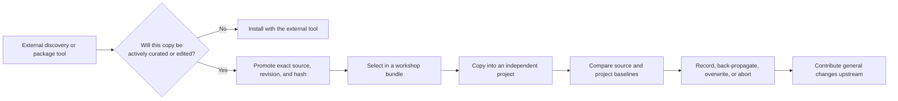

# Project viability and scope decision

Decision date: 2026-08-17.

## Verdict

Continue this repository as a **narrow curation and two-sided reconciliation
control plane**. Do not continue its broader evolution into a general skill
package manager, registry, search engine, installer, vendor-path mapper, or
governance platform.

The defensible job is:

> Copy a selected skill into an independent project, allow both the source and
> project copy to evolve, and later make the direction of change explicit
> without requiring the project to adopt this workshop's tooling or metadata.

The project is worthwhile only when that job occurs repeatedly. Existing tools
already serve most one-way discovery, packaging, installation, update,
validation, publication, and registry needs. The workshop should integrate
with those tools and retain only the state they do not own: local curation,
source-versus-project baselines, deliberate reconciliation decisions, and the
path back to a fork or canonical upstream.

This is a conditional continuation, not an endorsement of the previous feature
roadmap. Net-new product surface should remain frozen until a 60-day usage
pilot demonstrates repeated two-sided development.

## Current evidence

The implementation is much more mature than its usage evidence.

| Evidence at this decision | Current state |
| --- | --- |
| Upstream inventory | 216 skills in 3 pinned collections |
| Curated selections | 2 bundles containing 12 references |
| Core profile | Empty |
| Workshop-owned skills | None |
| Materialized project locks | None tracked |
| Hash-bound human reviews | None recorded |
| Implementation | 5,491 lines of Python |
| Automated verification | 98 tests plus lint, format, compile, and metadata checks |

The code demonstrates a serious safety implementation, particularly around
path handling, backups, pruning, and stale-state checks. It does not yet
demonstrate that the workflow saves enough time or prevents enough mistakes to
justify that maintenance surface. Absence of a competing tool with the exact
same feature combination is not evidence that the combination is valuable.

The current capability disposition is:

| Capability | Current status | Decision |
| --- | --- | --- |
| Pinned sources, forks, and canonical remotes | Implemented | Retain as support for contribution-back; add a fork only when contribution or durable divergence is likely |
| Inventory and VisiData views | Implemented | Retain unchanged; use external search instead of expanding into a catalog or ranking engine |
| Small home core profile and `link-core` | Implemented, currently empty | Retain the requested minimal profile; freeze profile/TUI expansion and evaluate `skill-manager` first |
| Bundles, import TUI, and project materialization | Implemented | Retain as the entry path to reconciliation; do not compete with general installers |
| Two-baseline status and four conflict policies | Implemented | Primary development focus during the pilot |
| Safe prune, verified backups, and retention | Implemented | Retain as safety support for reconciliation |
| Hash-bound trust review and heuristic inventory | Implemented, currently unused | Retain the ledger; consume external scan signals rather than expand the scanner |
| Tags | Not implemented | Evidence-gated; use names, descriptions, bundles, and external search now |
| Overlays, external adapters, vendor targets, and manager skill | Not implemented | Frozen pending their individual triggers |

This prevents “narrow scope” from silently discarding the small core profile
or pretending that all existing supporting machinery is unique. Implemented
support remains available, but new investment must serve the reconciliation
pilot or replace a component with less local maintenance.

## The value that is not already commodity functionality

Most individual workshop features have established alternatives:

- Git provides repositories, forks, remotes, revisions, branches, and diffs.
- Existing managers provide discovery, copies or symlinks, updates, locks,
  packs, profiles, target paths, and publication.
- Existing registries provide tags, ranking, versions, reviews, RBAC, and
  audit data.
- Existing tools provide format validation, integrity checks, drift reports,
  advisory scans, and SBOM export.

The workshop's useful residual is the combination of:

1. an ordinary, independently editable skill copy in a downstream project;
2. no workshop runtime, manifest, or lock imposed on that project;
3. parent-owned baselines for both the selected source and project copy;
4. read-only status and diffs that distinguish which side changed;
5. explicit `abort`, `record`, `back-propagate`, and `overwrite` choices;
6. conservative pruning and verified recovery backups; and
7. fork-versus-canonical upstream coordination for contributing general
   changes.

This is differentiated, not necessarily globally unique. A careful maintainer
could reproduce it with Git, copy tools, and process discipline. The workshop
earns its keep only if packaging that discipline as skill-aware state and
guardrails proves useful in practice.

### Replacement test against the closest alternatives

The official documentation reviewed on 2026-08-17 gives the following
provisional comparison. “Partial” means the tool performs a related operation
but does not preserve the workshop requirement as stated; it must be verified
in a spike rather than counted as coverage.

| Residual requirement | APM | `skill-manager` | ASM | Plain Git and copies | Workshop |
| --- | --- | --- | --- | --- | --- |
| Ordinary project copy may be edited independently | Partial: deploys copies but treats edits as drift | No: canonical-store symlinks are the main model | Partial: installs and exports, with no documented two-sided lifecycle | Yes, manually | Yes |
| No manager manifest, lock, or runtime is required downstream | No | No | Partial: the primary provider copy is consumable without ASM, while manager state is global; verify clone and relocation | Yes | Yes |
| Parent owns separate source and project baselines | No | No | No | No, unless recreated manually | Yes |
| Status identifies source-only, project-only, and both-side changes | Partial: deployment drift | Partial: source/deployment hashes and diffs | No documented equivalent | Manual Git comparisons | Yes |
| User chooses abort, record, back-propagate, or overwrite | No | No | No | Manual process | Yes |
| Pruning and replacement preserve recoverable state | Partial: prune and integrity, not the same recovery contract | Partial: history and backups | No documented equivalent | Partial: project Git only | Yes |
| Fork and canonical remotes support contribution-back | No documented coordination workflow | Source sync, but no documented fork/canonical workflow | Source pins, but no documented contribution workflow | Yes, manually | Yes |

Before keeping or extending the workshop, test APM, `skill-manager`, ASM, and
plain Git against these same acceptance cases. A replacement candidate must:

- satisfy the manager-free downstream boundary, immutable source identity,
  local-edit preservation, export/removal, and no-lost-change tests; and
- satisfy at least six of the seven residual requirements, with at most one
  missing non-safety behavior supplied by a removable integration taking no
  more than one working day.

If a candidate clears that test, adopt or contribute the missing behavior
instead of maintaining the workshop kernel. This is a test plan, not a claim
that the current documentation proves every candidate fails it.

## Promotion boundary

Trying or installing a skill should not automatically bring it under workshop
management. Promotion is appropriate only when a skill will be curated,
modified, shared across projects, reviewed at an exact revision, or developed
back toward an upstream.



This boundary keeps the workshop small. Unchanged commodity skills bypass it;
only skills with a credible two-sided lifecycle enter it.

No external-manager adapter exists today. The interim promotion route is
manual and intentionally explicit:

1. Use `gh skill`, Vercel `skills`, SkillPort, ASM, or a registry only to find,
   preview, or try the candidate.
2. Resolve its canonical Git URL, skill subpath, commit SHA, and skill-tree
   digest. A tag may be retained as a readable label, but it is not immutable
   evidence because remote tags can move. Do not promote an installer-mutated
   `SKILL.md` or a symlinked cache as the canonical artifact.
3. Reuse an existing registered source. Add a pinned source only when active
   curation is expected, and create a fork only when contribution or durable
   divergence is likely.
4. Review the exact tree and run pinned
   `skills-ref validate <skill-directory>`, then apply the standard's field and
   directory rules as an explicit workshop checklist when portability is
   claimed. SkillPort lint may be useful secondary evidence, but its documented
   metadata extensions mean it is not the exact conformance oracle.
5. Record nonstandard vendor fields explicitly. A failing skill may remain a
   vendor-specific candidate, but it must not be described as portable.
6. Select the validated/reviewed source in a bundle and materialize it through
   the workshop.

The current CLI does not enforce step 4. Until a reused validation tool is
integrated, it is a documented manual gate and a known limitation of the
pilot—not a reason to write another parser immediately.

## Adopt, wrap, or build

The default owner of each capability should be explicit.

| Need | Default choice | Workshop role |
| --- | --- | --- |
| Portable skill directory format | [Agent Skills specification](https://agentskills.io/specification) | Conform; do not extend the runtime format |
| Format-conformance differential | Pinned [`skills-ref`](https://github.com/agentskills/agentskills/tree/69ef37e9424c0a7ea9dd2293b559e43ec8176379/skills-ref) plus an explicit workshop policy checklist | Do not claim portability solely from metadata validation |
| Package manifest, dependency graph, integrity lock, frozen replay, target deployment, integrity/drift/hidden-Unicode audit, or provenance SBOM | [Microsoft APM](https://github.com/microsoft/apm) | Time-box an integration spike; do not build competing infrastructure |
| GitHub discovery, preview, exact pin, update, or release publication | [`gh skill`](https://cli.github.com/manual/gh_skill) | Import or publish through a thin boundary when useful |
| Broad source and agent support, quick trials, one-way install, or Packs | [Vercel `skills`](https://github.com/vercel-labs/skills) | Let unchanged skills stay under that manager |
| Local management, full-text search, MCP delivery, and SkillPort's own lint | [SkillPort](https://github.com/gotalab/skillport) | Reuse its service or library rather than build search/MCP; do not treat its extensions as the conformance oracle |
| Personal canonical store, profiles, symlinks, and TUI | [`skill-manager`](https://github.com/omrikais/skill-manager) | Evaluate before expanding the core profile |
| Personal GitHub-backed inventory, fuzzy TUI with metadata/description preview, and read-only MCP | [`skills-registry`](https://github.com/nikships/skills-registry) | Adopt rather than expand inventory search or preview UI |
| Cross-provider catalog, installer, and advisory scan | [ASM](https://github.com/luongnv89/asm) | Consume results as observations; do not make them canonical trust decisions |
| Organizational registry, versions, review, RBAC, and audit | [SkillHub](https://github.com/iflytek/skillhub) | Do not build an enterprise registry here |
| Parent-held two-sided baselines and contribution-back workflow | This workshop | Maintain the narrow reconciliation kernel |

APM is the most consequential alternative omitted from the earlier review. Its
documented `apm.yml` and `apm.lock.yaml` model already covers transitive
resolution, hashes, multi-client deployment, packaging, policy, drift checks,
and SBOM export. Its built-in audit covers integrity, drift, and hidden
Unicode; policy enforcement and external scanner integration are early-preview
features, and its SBOM is provenance inventory rather than a compliance
attestation. APM should replace or defer any plan to build those generic
capabilities here. Its project-local manifest and lock are also an intentional
contrast: use APM when collaborators should reproduce package state from the
downstream project; use the workshop when coordination state must remain in a
separate parent and project copies are expected to evolve independently.

There are two mutually exclusive APM modes:

- for unchanged downstream dependencies, APM owns the project's `apm.yml`,
  `apm.lock.yaml`, and deployment; the workshop is bypassed; or
- for workshop promotion, APM may be tested only as a resolver in a disposable
  staging area. Only an ordinary skill tree plus immutable source evidence may
  cross the boundary, and no APM manifest or lock is imposed downstream.

If APM cannot support the staging-only mode cleanly, it is an alternative for
project-local package management rather than a workshop integration. No APM
integration exists in the current code.

Do not maintain two co-equal locks for the same job. If APM is integrated, its
lock is derived package-resolution or deployment state. The workshop lock is
authoritative only for its separate source-versus-project reconciliation job.

These defaults still require maturity checks. APM is pre-1.0 and OpenAPM is a
working draft, `gh skill` is a public preview, and SkillPort describes itself
as work in progress. Pin tested versions, keep their state outside the
workshop's canonical reconciliation record, and retain a removal path.

## How to integrate continually emerging efforts

“Reuse first” should be a decision procedure, not an aspiration to build a
universal adapter framework.

Before implementing any new capability:

1. Name the repeated incident or task that requires it.
2. Search the Agent Skills project, active managers, registries, and relevant
   vendor tooling for an existing implementation.
3. Record the candidate's license, maturity, data model, immutable identity,
   local-edit behavior, export path, and maintenance activity.
4. Run a time-boxed integration or configuration spike of no more than one
   working day for the strongest candidate.
5. Define pass/fail acceptance cases before the spike. Adopt the component
   only if it passes every safety-critical case and any missing convenience
   behavior can be handled by a thin, removable boundary. Use the seven-case
   replacement test above when deciding whether it can replace the workshop.
6. Build locally only when the missing behavior is part of the workshop's
   two-sided reconciliation job and cannot reasonably be contributed upstream.
7. Keep external results namespaced and timestamped. A provider rank, audit
   signal, generated tag, and workshop human review are different claims.
8. Revisit the decision before a new feature and at the end of each pilot, not
   by maintaining an exhaustive duplicate catalog of the ecosystem.

An integration should exchange ordinary skill trees, immutable source
references, hashes, or machine-readable observations. It should not make an
external provider's mutable index the workshop's source of truth. Conversely,
the workshop should not copy a provider's search, package, or deployment logic
behind a nominal “adapter.”

The current prose landscape is sufficient as a dated decision ledger. A new
machine-readable ecosystem database is not justified until there are enough
active integrations for prose to cause real inconsistency or automation is
needed.

## Feature disposition

### Maintain now

- bundle manifests and exact source identities;
- the small core profile and its existing link reconciliation;
- basic inventory and VisiData views without a new search backend;
- project import and ordinary copied skill trees;
- two-baseline locks, status, diffs, and four explicit conflict policies;
- conservative pruning and verified backups;
- the existing hash-bound review ledger without expanding generic scans;
- fork/canonical remote coordination; and
- tests protecting these operations.

### Delegate now

- generic discovery, search, package resolution, transitive dependencies,
  registries, publication, multi-agent path maps, SBOMs, and generic security
  scans;
- one-way installation and update of unmodified skills; and
- enterprise governance and access control.

### Freeze until evidence

- **Tags:** keep the distinction between descriptive tags and deployable
  bundles, but do not create `metadata/tags.yaml` or a tag CLI merely because a
  proposal exists. Reconsider only after at least 20 actively promoted skills
  and three logged selection failures in which names, descriptions, bundles,
  and an existing search tool could not express the needed facet. Prefer an
  accepted recipe format or an existing manager's exportable tags.
- **Overlays:** do not build a general patch engine. First require the same
  small, non-upstreamable modification at least three times across at least two
  projects. Until then, use a project edit, upstream change, or fork.
- **Vendor adapters:** use APM, `gh skill`, or Vercel `skills` for ordinary
  target placement. Reconsider only when at least two real projects require the
  same unsupported target and a one-day APM/Vercel configuration spike cannot
  preserve parent-held reconciliation.
- **Search and retrieval:** use an existing index or registry. Create a local
  relevance set only after three logged retrieval failures across at least two
  task families using the current inventory plus the best existing search
  candidate. Use it to compare tools, not to justify a new search product.
- **Manager skill:** create a thin procedural skill only after the pilot
  records at least five repeated workshop workflows and two command-selection
  or policy errors that a procedural skill could have prevented. Deterministic
  Python must continue to own mutation and safety; prose should never
  reimplement it.
- **Generic adapters:** implement the first two integrations directly. Extract
  an interface only after both duplicate at least three operations or metadata
  fields and reveal a stable common contract.

## Tool choice by decision criterion

| Situation | Preferred choice |
| --- | --- |
| One to three stable skills, no managed update path | Commit ordinary copies or use the vendor's installer |
| Reproducible project-local dependency state for collaborators | APM manifest and lock |
| GitHub-native search, pinning, update, and publication | `gh skill` |
| Many sources or agent hosts, Packs, or try-without-install | Vercel `skills` |
| Search-first loading or MCP delivery for a large local inventory | SkillPort |
| Personal global canonical store and symlinked profiles | `skill-manager` or a dotfile manager |
| GitHub-backed personal inventory with fuzzy TUI and metadata/description preview | `skills-registry` |
| Self-hosted organizational governance | SkillHub |
| One project with intentionally edited skills | Ordinary project Git or a source fork |
| Multiple projects with edited copies, a shared source, parent-held state, and contribution-back needs | This workshop |
| A general correction | Change the fork and contribute upstream |
| A large independent evolution | Maintain a distinct fork/source |

The optimal hybrid is usually:

> discover and try with an existing manager → promote only deliberately
> developed skills → reconcile them in the workshop → contribute or publish
> with Git, `gh skill`, APM, or the relevant vendor flow.

## Opportunity cost and break-even test

Workshop engineering displaces the work that gives the skills themselves
value: reviewing scientific skills, trying them on real tasks, measuring their
behavior, improving them, and contributing changes upstream. Catalogs, tag
schemas, ranking experiments, vendor-path tables, and generic adapters are
particularly expensive distractions when existing tools already own them.

Use this break-even check for any proposed feature:

```text
required unique events per month =
    monthly maintenance hours × 60 / minutes saved per event
```

For example, eight maintenance hours per month and 20 minutes saved per unique
event require 24 such events per month merely to break even. Already-spent
effort is sunk cost and should not influence the decision.

## Sixty-day proof-of-value pilot

The committed [pilot ledger](usage-pilot.md) defines the start condition,
owner, day-30 and day-60 reviews, evidence fields, and accounting rules. A
**unique-value event** is a deliberate `record` or `back-propagate` decision,
a both-sides conflict resolved using separate baselines, or fork/canonical
coordination that produces a submitted upstream pull request or issue-backed
patch. A skill change reused in at least two downstreams may substitute for the
upstream result. Search, copy, link, install, overwrite, routine status, and
ordinary one-way update do not count.

One underlying divergence or contribution episode counts once even if it
matches several categories; a later pull request is an outcome of that event,
not another event.

Continue active development after 60 days only if all of these are true:

- at least two downstream projects have completed a real status, apply, or
  reconcile operation;
- at least three unique-value events occurred across at least two projects,
  including at least one `record` or `back-propagate` decision;
- at least one submitted upstream pull request or issue-backed patch, or one
  concrete skill change reused in at least two downstream projects, resulted
  from the flow;
- there were no lost-change incidents and no more than one manual lock repair;
- cumulative operation benefit, including negative commodity-operation
  deltas, was at least twice cumulative workshop maintenance time; and
- every named replacement candidate was tested at a pinned revision or
  evidence-backed disqualified, and none passed every safety-critical case plus
  at least six of seven residual requirements with one working day or less of
  removable integration.

Apply outcomes in this order:

1. **Stop** if any stop condition below is true.
2. **Continue** only if every continue gate above is true.
3. **Pivot or re-scope** every other result. In particular, if at least 75% of
   recorded operations are commodity discovery, installation, or update, make
   the relevant external manager primary. If the only durable value is the
   two-baseline algorithm, extract it as a small library or contribute it to an
   existing manager.

Stop active development and archive the repository if there are no
unique-value events in 60 days, fewer than two active downstream projects, or
maintenance cost meets or exceeds the measured benefit for two consecutive
review intervals—days 1–30 and days 31–60 in the pilot ledger. Also stop if a
replacement passes the test above and its recorded switching hours are less
than three times the pilot's 60-day maintenance hours, the projected six-month
maintenance cost. A lost-change incident pauses rollout immediately and
triggers a safety review;
resume only if the failure is understood, repaired, and covered by a
regression test.

Before archiving:

1. Run final status and diffs for every lock.
2. Resolve or export every divergence and retain source/revision/provenance
   evidence that will still matter.
3. Commit intended downstream copies and migrate unchanged installs to APM,
   `gh skill`, Vercel `skills`, `skill-manager`, or plain copies.
4. Replace or remove core-profile symlinks that point into this repository.
5. Preserve any required ignored backups outside the 30-day cleanup path.
6. Keep the repository and locks as read-only history.

After those steps, bundles remain readable selections, upstreams remain Git
repositories, and downstream projects contain ordinary skill trees; archiving
does not strand their runtime use.

## Immediate next actions

1. Keep the version 1/2 → version 3 lock migration, legacy readers, and
   compatibility tests green.
2. Before the first pilot promotion, run and record pinned external conformance
   checks; do not claim portability for failures.
3. Use one real downstream project for a complete apply → project edit →
   status/diff → record or back-propagate → reapply cycle.
4. Test the seven replacement cases against plain Git, `skill-manager`, ASM,
   and APM, cheapest and closest first. For APM, use disposable staging and
   test immutable resolution, byte identity, frozen replay, and export without
   imposing APM state on the downstream project.
5. Start the 60-day ledger at the first qualifying project operation and record
   unique-value events, commodity operations, and all maintenance cost.
6. Revisit tags, overlays, vendor targets, and a manager skill only if the
   pilot produces their stated trigger conditions.

The supporting ecosystem evidence and standards details remain in the
[landscape report](skill-management-landscape.md). The concise operating
recommendation is in the
[executive summary](skill-management-executive-summary.md).
