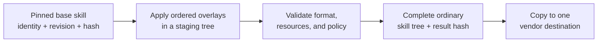

# Skill management landscape and standards comparison

Research snapshot: 2026-08-14. The workshop was assessed at commit
`e177493`. The Agent Skills repository was assessed at commit
[`69ef37e`](https://github.com/agentskills/agentskills/commit/69ef37e9424c0a7ea9dd2293b559e43ec8176379).
The standard currently has no tagged release, so claims in this report should
be rechecked as its documentation and client implementations evolve.
Source-code links are pinned where implementation details matter; product
documentation otherwise reflects the research date.

## Scope and central finding

The workshop and the [Agent Skills standard](https://agentskills.io/home)
operate at different layers:

- the standard defines the portable **skill artifact**: a directory containing
  `SKILL.md` and optional resources;
- this workshop is a **lifecycle control plane** around those artifacts: it
  discovers upstreams, groups skills, records provenance and review state,
  materializes copies, detects two-sided changes, reconciles them, and keeps
  recovery backups;
- each agent product is a **runtime/client, and sometimes an installer**, that
  decides where to discover skills, how to activate them, and what tools or
  execution environment they receive.

Most workshop metadata is therefore an extension outside the standard, not a
competing format. Clusters, profiles, locks, trust reviews, and backups remain
in this repository, while downstream projects receive ordinary skill
directories. That boundary is sound. The principal standards gap is that the
workshop currently does not fully validate the ordinary skill directories it
manages.

## Standards alignment

### What the standard defines

The [format specification](https://agentskills.io/specification) requires a
skill directory with a `SKILL.md` containing valid YAML frontmatter followed by
Markdown instructions. Its required fields are:

- `name`: 1 to 64 lowercase letters, numbers, and hyphens; no leading, trailing,
  or consecutive hyphens; it must match the parent directory name;
- `description`: 1 to 1,024 characters explaining both what the skill does and
  when it should be used.

Standard optional fields are `license`, `compatibility`, a string-to-string
`metadata` map, and the experimental `allowed-tools` string. Conventional
resource directories are `scripts/`, `references/`, and `assets/`, although
other files and directories are allowed. File references are relative to the
skill root. Shallow reference chains, a concise `SKILL.md`, and moving detailed
material into on-demand resources are recommendations supporting the
progressive-disclosure loading model.

The current specification does **not** mandate installation roots and does not
define package registries, package versioning or version selection, dependency
resolution, profiles, clusters, overlays, trust-review records, conflict
resolution, or backups. Its
[client implementation guide](https://agentskills.io/client-implementation/adding-skills-support)
describes `.agents/skills` as a widely adopted interoperability convention,
not a normative location.

### Conformance and extension table

| Area | Agent Skills requirement or guidance | Workshop behavior | Assessment |
| --- | --- | --- | --- |
| Artifact | Directory containing `SKILL.md` | Copies complete skill directories | Aligned |
| Project location | Not standardized; `.agents/skills` is recommended for interoperability | Materializes into `.agents/skills` | Good convention, not universal |
| Frontmatter | Valid YAML with opening and closing delimiters | Extracts a simple `name:` line | Conformance gap |
| `description` | Required, nonempty, at most 1,024 characters | Not parsed or validated | Conformance gap |
| `name` | Exact syntax, no trailing or consecutive hyphens | Current regular expression permits both and accepts ASCII only | Looser about hyphens and narrower than the pinned reference implementation about non-ASCII names |
| Directory identity | Parent directory must match `name` | Manifest name must match declared name, but the source directory basename need not match | Conformance gap |
| Optional fields | Defined types and limits | Preserved but not validated or inventoried | Conformance gap |
| Body and resources | Markdown plus optional relative resources | Complete tree is copied | Aligned |
| Nested symlinks | No portable semantics specified | Refused during materialization | Deliberate safety restriction |
| Core-profile links | Client-specific | Top-level directory symlinks into `~/.agents/skills` | Useful local extension; test per client |
| Progressive disclosure | Runtime loads metadata, then instructions, then resources | Delegated to the agent runtime | Appropriate; workshop is not a client |
| Collisions | Client should behave deterministically | Cluster duplicate install names are refused | Appropriate manager policy |
| Trust | Client guide recommends considering a trust gate | Hash-bound advisory review ledger | Strong extension; not an enforcement gate |
| Distribution and version resolution | Out of scope | Forks, submodules, remotes, revisions, and update plans | Workshop extension |
| Selection and grouping | Out of scope | Profiles and clusters | Workshop extension |
| Reconciliation | Out of scope | Two baselines and four explicit conflict policies | Workshop extension |
| Recovery | Out of scope | Verified content-addressed backups with explicit 30-day cleanup | Workshop extension |
| Overlays | No accepted mechanism | Not yet implemented | Desired control-plane feature |

Profiles and clusters select sets of independent skills; they are not runtime
skill composition. Skill-to-skill dependency and invocation semantics are also
not standardized.

The distinction between `validate-metadata` and skill validation matters.
[`validate_metadata.py`](../scripts/validate_metadata.py) protects cluster,
lock, and trust contracts used by workshop operations. It is not a complete
Agent Skills validator. Likewise, the runtime checks in
[`manage_skills.py`](../scripts/manage_skills.py) are intentionally focused on
safe paths, names, real directories, and stable content before destructive
operations.

### Current catalog portability

A research pass using the pinned official reference validator over the 216
upstream skills produced this result. The method discovered each upstream
`SKILL.md`, ran `skills-ref validate <skill-directory>` from the reference
checkout named above, and counted runs that returned no problems.

| Collection | Pinned `skills-ref` passes | Total | Main source of failures |
| --- | ---: | ---: | --- |
| K-Dense scientific skills | 161 | 161 | None in this snapshot |
| NiPreps skills-comm | 22 | 42 | Nonstandard vendor activation fields and some strict-YAML values |
| CON skills | 3 | 13 | Mainly `user-invocable`; one missing required `name` |

The official [`skills-ref`](https://github.com/agentskills/agentskills/tree/69ef37e9424c0a7ea9dd2293b559e43ec8176379/skills-ref)
README explicitly calls the library demonstrational rather than production
ready. It also does not enforce every detail of the written specification.
These counts should therefore be treated as a pinned compatibility
measurement, not an infallible conformance judgment. They nevertheless expose
a real difference between “loads in a particular client” and “returns no
problems from the pinned reference checks.”

The issue reaches the current clusters. Their selected NiPreps and CON skills
use nonstandard activation keys such as `argument-hint`, `user-invocable`, and
`disable-model-invocation`, and comma-delimited `allowed-tools` values. These
may be meaningful to particular clients, but the shared format does not define
the activation keys and defines `allowed-tools` as an experimental
space-separated string.

Portability should consequently be reported in three separate dimensions:

1. **Format portability:** a specification-conformant `SKILL.md` and resource
   tree.
2. **Discovery portability:** whether the host scans the chosen location and
   supports the chosen link or copy method.
3. **Behavioral portability:** whether tools, dependencies, permissions,
   network access, invocation behavior, and runtime semantics are available.

A skill can pass the first test and fail the other two.

## Lessons from the pinned upstreams

The three upstreams are complementary rather than interchangeable models.

### K-Dense scientific-agent-skills

The pinned [K-Dense collection](https://github.com/K-Dense-AI/scientific-agent-skills/tree/13385c7c4db02fdcc84a020752c07cce91ef780e)
has the strongest portable-format and repository-quality model of the three.
Its
[contribution guide](https://github.com/K-Dense-AI/scientific-agent-skills/blob/13385c7c4db02fdcc84a020752c07cce91ef780e/CONTRIBUTING.md)
requires exact standard naming and frontmatter, repository-level tests for
script-bearing skills, reference validation, and additional CI checks. Its
[security policy](https://github.com/K-Dense-AI/scientific-agent-skills/blob/13385c7c4db02fdcc84a020752c07cce91ef780e/SECURITY.md)
combines recurring automated scans with explicit warnings that scan output is
not an audit.

This is the best upstream to emulate for structural validation, test layout,
and portable frontmatter. Its breadth also means dependencies, credentials,
and network behavior vary substantially by skill; the workshop's selective
clusters and hash-bound review remain valuable.

### NiPreps skills-comm

The pinned [NiPreps collection](https://github.com/nipreps/skills-comm/tree/ded6d5ea77cdae0c01f384fc306e12fe5973f00d)
has the strongest domain-operational model. Its
[contribution process](https://github.com/nipreps/skills-comm/blob/ded6d5ea77cdae0c01f384fc306e12fe5973f00d/CONTRIBUTING.md)
starts with an issue, emphasizes reproducible environments, BIDS/DataLad
provenance, quality control, and requires manual end-to-end evidence. Its
`skill-iterations/` examples show how a rough domain skill is progressively
hardened.

The current pin explicitly says it has no CI test harness, and many skills use
Claude plugin packaging and vendor activation keys. It is therefore a strong
source for neuroimaging behavior and contribution practice, but not yet the
best portability baseline. Workshop validation and target classification
should surround it without erasing useful Claude behavior.

### CON skills

The pinned [CON collection](https://github.com/con/skills/tree/493d7e83865ed5c21a8f4e5b02e72fc47bce5bb3)
contains focused maintenance, triage, compliance, and repository-health
workflows closely aligned with this workshop. Its small size and direct fork
relationship make upstream contribution straightforward.

At this pin, its [README](https://github.com/con/skills/blob/493d7e83865ed5c21a8f4e5b02e72fc47bce5bb3/README.md)
documents Claude installation, declares licensing as unresolved, and many
skills use vendor activation keys. Automated tests are concentrated in the
`issue-triage` skill rather than enforced across the collection. The workshop
adds material value here through conformance diagnostics, licensing review,
cluster selection, and safe project reconciliation.

## Alternative approaches and existing tools

Among the tools reviewed, no single tool covers the workshop's whole intended
workflow. The strongest approach is to compose specialized tools at clear
boundaries.

### Comparison at a glance

| Approach | Strongest use | Advantages over the workshop | Advantages of the workshop |
| --- | --- | --- | --- |
| Agent Skills `skills-ref` | Format validation and prompt catalog examples | Closest reference interpretation of the standard | Production safety, lifecycle state, reconciliation, trust, and recovery |
| GitHub CLI `gh skill` | GitHub discovery, preview, install, update, pin, and publish | First-party GitHub workflow, many host destinations, format/release checks, release and SHA pins | Clusters, external locks, fork coordination, two-sided changes, back-propagation, review ledger |
| Vercel `skills` / skills.sh | Broad multi-agent discovery and one-way installation | Many sources and hosts, search, packs, copy/symlink choices, local and global state, advisory audit signals | Conservative local-edit handling, independent project development, hash-bound review and backup policies |
| Native vendor installers and plugins | Product-specific distribution | Best integration with each product's UI, MCP, hooks, and policies | One portable source of truth and vendor-neutral development workflow |
| Git submodules and forks alone | Exact upstream pins and contribution branches | Standard Git primitives and full history | Skill-level inventory, clusters, project materialization, status, and safe conflict policies |
| Plain copies | Small, stable project sets | Minimal tooling and maximum downstream independence | Provenance, updates, drift detection, reconciliation, and recovery |

### Official reference tooling

The standard's reference repository supplies `skills-ref` to validate a skill,
read properties, and generate an `<available_skills>` catalog. It is the most
useful compatibility oracle, but its
[own warning](https://github.com/agentskills/agentskills/blob/69ef37e9424c0a7ea9dd2293b559e43ec8176379/skills-ref/README.md)
means it should be pinned and used in CI alongside workshop-owned tests rather
than trusted as the sole production parser.

The [official evaluation guidance](https://agentskills.io/skill-creation/evaluating-skills)
also fills a gap the workshop's current 85 management tests do not address. It
recommends realistic prompts, clean contexts, runs with and without the skill,
machine-checkable assertions where possible, blind comparisons, and human
review. Management correctness and skill effectiveness are different test
layers; both are needed.

### Existing agent-facing helper skills

There are useful agent-facing helpers, but none reviewed is a portable manager
for this full lifecycle. The
[Codex documentation](https://developers.openai.com/codex/skills) describes a
bundled `skill-installer` for curated skills and Git repository paths. It is a
convenient local installation interface, not a cluster, lock, reconciliation,
overlay, or upstream-contribution system.

The Agent Skills evaluation guide points to `skill-creator`, which supports
authoring, realistic evaluation prompts, graders, comparisons, and iterative
improvement. That is a strong basis for testing individual skills and the
future workshop-manager skill, but it does not manage an inventory of
independently versioned sources and project copies. The gap is therefore not
“another installer”; it is a thin, well-evaluated agent interface over this
workshop's deterministic lifecycle commands.

### GitHub CLI `gh skill`

GitHub CLI 2.90 and later includes `gh skill` in public preview. It can
[search, preview, install, pin, and update skills](https://docs.github.com/en/copilot/how-tos/copilot-on-github/customize-copilot/customize-cloud-agent/add-skills),
choose among many agent destinations, and
[perform format/release checks or publish skill releases](https://cli.github.com/manual/gh_skill_publish).
It records source and tree provenance in installed `SKILL.md` metadata. These
checks are not a safety review: GitHub warns that third-party skills remain
unverified and can contain malicious instructions or scripts.

The workshop's locked Pixi environment currently provides GitHub CLI 2.97, so
this preview can be evaluated without adding another runtime dependency.

Its strengths are ecosystem discovery, pre-install inspection, GitHub-native
version selection, host path knowledge, and release transport. Its model is
still principally one way: upstream to installed copy. A
[normal or forced refresh](https://cli.github.com/manual/gh_skill_update) may
replace local modifications rather than reconcile them. It does not document
cluster/profile composition, a separate two-sided lock,
back-propagation, fork-to-canonical coordination, a hash-bound review ledger,
deterministic overlays, or verified recovery backups.

This makes `gh skill` a good future **import and publication backend**, not a
replacement for the workshop when project copies are expected to evolve and
contribute changes back. An import adapter should read the recorded upstream
ref/tree or strip `metadata.github-*` installer fields rather than treating an
installer-mutated `SKILL.md` as the canonical source.

### Vercel `skills` and skills.sh

The [Vercel `skills` CLI](https://github.com/vercel-labs/skills) is a broad
multi-agent installer reviewed here. It supports GitHub, GitLab, arbitrary Git
and local sources, project and global installs, many agent path mappings,
skill selection, copy or symlink installation, one-off use, search, list,
remove, check, update, and initialization. It has both a project
[`skills-lock.json`](https://github.com/vercel-labs/skills/blob/c6f69c631292444cc541ac6d91e2226b0ff247da/src/local-lock.ts)
and global installation state, plus a substantial automated test suite.

It is optimized for convenient distribution and one-way refresh. Its update
path does not provide the workshop's “record both,” “back-propagate,” or
two-sided divergence workflow for a locally developed project copy. Its
project lock is intended to live in the downstream project, whereas this
workshop deliberately keeps coordination metadata in the parent control
plane. skills.sh does offer account-managed
[Packs](https://www.skills.sh/docs/packs) for grouped installation, but these
are not repository-native, version-controlled, hash-bound workshop clusters or
profiles. The system also lacks canonical-versus-fork remotes, hash-bound
human reviews, and the workshop's conservative prune and backup policy.

skills.sh aggregates
[advisory signals from external audit providers](https://www.skills.sh/audits).
Those signals are useful discovery cues, but they do not replace a human
review bound to the exact tree digest being materialized.

The two systems can interoperate: use `skills` for commodity discovery and
multi-host installation, then import selected skills into the workshop when
they require curation, modification, review, or bidirectional project work.
Path maps must still be checked against current vendor documentation because
vendor locations evolve independently.

### Native installers and plugins

[OpenAI's skill guidance](https://developers.openai.com/codex/skills) recommends
standalone directories for local or repository authoring and plugins for
reusable distribution bundles. An OpenAI plugin may include multiple skills,
MCP servers, connectors, hooks, and assets, and a skill can add
`agents/openai.yaml` for OpenAI-specific UI and dependency metadata. Claude
plugins and other vendor packages use different manifests.

The portable core should therefore remain the ordinary skill directory. A
vendor plugin is a distribution adapter around that core, not its canonical
source. This avoids letting one vendor's packaging format determine the
workshop's internal model.

### Emerging packaging proposals

Two discussions in the Agent Skills repository are relevant but are not
standards:

- [Discussion 210](https://github.com/agentskills/agentskills/discussions/210)
  proposes a package manifest, dependency identities, content integrity, and a
  common lockfile;
- [Discussion 292](https://github.com/agentskills/agentskills/discussions/292)
  explores OCI distribution, signatures, provenance, and layer-based
  packaging, including possible overlay benefits.

They could eventually offer interoperable package and supply-chain machinery.
Today they do not cover the workshop's two-sided project development,
clusters, review state, or conflict menu, and their schemas should not yet be
treated as settled standards. The workshop already records enough URL,
revision, identity, and digest information to support a future exporter.

The proposed package lock and the existing workshop locks solve different
problems. A package lock would record dependency resolution and installation
integrity. A workshop materialization lock is a per-project reconciliation
receipt with separate source and project baselines. A future common package
lock would complement rather than replace the workshop lock.

## Overlays

### Why overlays are needed

The current choices are too coarse for a small, durable specialization:

- edit the project copy, which creates whole-tree divergence;
- back-propagate the entire project tree into the workshop;
- fork and maintain a nearly identical skill;
- put local detail into an ad hoc project prompt.

The Agent Skills format does not define inheritance, tree merging,
skill-to-skill imports, or overlay behavior. Its client guide treats same-name
skills as collisions resolved through deterministic precedence, so portable
tooling must not assume that installing two same-name skills composes them. An
overlay must therefore be a workshop build input, not a new artifact that the
agent is expected to understand.

| Specialization strategy | Benefits | Costs and risks |
| --- | --- | --- |
| Full fork | Ordinary Git history; easy to develop and contribute substantial changes | Duplicates the whole skill and accumulates upstream drift |
| Edited downstream copy | Maximum project independence; no extra format | The reusable intent is hidden inside whole-tree divergence |
| Wrapper skill delegating to a base | Leaves the base untouched | Skill-to-skill invocation and dependency availability are not standardized |
| Runtime-loaded overlay support file | Fits progressive disclosure and avoids generation | Requires overlay-aware instructions or clients and has no shared precedence semantics |
| Workshop-rendered overlay | Produces one ordinary portable artifact; can be hashed, previewed, and tested | Requires a renderer, conflict model, and rebase workflow |

### Existing overlay precedents

There is no accepted overlay standard, but two precedents are informative:

- an independent [draft Skill Overlays RFC](https://gist.github.com/nibzard/dc79fe1f3954a0594fc8414d6f8cea28)
  treats overlays as optional support files loaded after activation; clients
  that do not know the convention ignore them. This preserves the base but
  requires overlay-aware runtime behavior and does not solve deterministic
  project materialization;
- the [Vercel plugin's upstream sync](https://github.com/vercel/vercel-plugin/blob/11c32588786a9d49791372657433b88d49561874/README.md#upstream-skill-sync)
  keeps an upstream subtree, an `overlay.yaml`, and a generated complete
  `SKILL.md`, with CI checking that generated output is current. This is closer
  to the workshop's needs as a precedent for build-time composition. It is not
  a general patch system: it replaces upstream frontmatter, appends the body,
  copies a fixed resource set, and records no base digest or rebase state. Its
  metadata and injection model are Vercel-specific.

### Recommended overlay contract

Store overlay inputs only in the workshop and render a complete standard skill
before materialization. A first version should record:

- immutable base identity, source URL, revision, and tree digest;
- ordered overlay files and their digests;
- an optional target vendor or compatibility profile;
- a deliberately small operation set, initially append or replace a named
  managed section plus explicit file add/delete operations;
- the rendered tree digest and validation result.

Apply overlays in an isolated staging tree, refuse a stale base or failed
patch, show the composed diff, validate the result, and only then materialize
it.
When upstream changes, re-render against the new base and expose conflicts as
a rebase operation. Do not attempt semantic Markdown merging.

Small vendor companion files are a good first use case. Generic corrections
should still be made in the fork and contributed upstream. A large or
independently versioned change should remain a fork rather than an overlay.

## Vendor compatibility

### Shared location and syntax

`.agents/skills` is the broadest common project and user convention among the
clients reviewed: Codex, GitHub Copilot, Gemini CLI, Cursor, and OpenCode all
document it. Claude Code remains the important exception: its documented roots
are `.claude/skills` and `~/.claude/skills`. This makes the workshop's current
destination broadly interoperable, but not universal.

| Host | Project roots relevant here | User roots relevant here | Notable differences |
| --- | --- | --- | --- |
| [OpenAI Codex](https://developers.openai.com/codex/skills) | `.agents/skills` from working directory to repository root | `~/.agents/skills` | Follows directory symlinks; optional `agents/openai.yaml`; plugin distribution is separate |
| [Claude Code](https://code.claude.com/docs/en/skills) | `.claude/skills` from the start directory through repository parents, plus descendant roots on demand | `~/.claude/skills` | Does not support/document `.agents`; adds vendor frontmatter and runtime features; local rules can be more lenient than the standard |
| [GitHub Copilot](https://docs.github.com/en/copilot/reference/copilot-cli-reference/cli-command-reference) | `.github/skills`, `.agents/skills`, `.claude/skills` | `~/.copilot/skills`, `~/.agents/skills` | Product-specific invocation fields; Copilot CLI documents first-found precedence, while other surfaces do not; symlinks are not a safe portability assumption |
| [Gemini CLI](https://geminicli.com/docs/cli/skills/) | `.gemini/skills`, `.agents/skills` | `~/.gemini/skills`, `~/.agents/skills` | Explicit activation consent; deterministic tier precedence; supports a symlink-linking workflow; parser and depth rules are more lenient than the standard |
| [Cursor](https://cursor.com/docs/skills) | `.cursor/skills`, `.agents/skills`, `.claude/skills`, `.codex/skills` | `~/.cursor/skills`, `~/.agents/skills`, `~/.claude/skills`, `~/.codex/skills` | Recursive discovery and `paths`/invocation extensions; duplicate and symlink behavior are not fully documented |
| [OpenCode](https://opencode.ai/docs/skills) | `.opencode/skills`, `.claude/skills`, `.agents/skills` | `~/.config/opencode/skills`, `~/.claude/skills`, `~/.agents/skills` | Recognizes the standard core fields except experimental `allowed-tools`, ignores unknown keys, and controls access with separate host permissions |

Primary vendor sources are the
[Codex skill guide](https://developers.openai.com/codex/skills),
[Claude Code skill guide](https://code.claude.com/docs/en/skills),
[GitHub Copilot skill overview](https://docs.github.com/en/copilot/concepts/agents/about-agent-skills),
[Gemini CLI skill guide](https://geminicli.com/docs/cli/skills/),
[Cursor skill guide](https://cursor.com/docs/skills), and
[OpenCode skill guide](https://opencode.ai/docs/skills).

These rows describe filesystem discovery by coding agents. OpenAI documents
the roots in the table for Codex; it does not describe them as a raw local
installation path for ChatGPT on web or mobile. Reusable ChatGPT and Codex
distribution across surfaces uses plugin packaging.

Claude Code's lack of `.agents/skills` support is not merely an omitted example:
the official [compatibility request was closed as not planned](https://github.com/anthropics/claude-code/issues/66352).
Gemini CLI is more permissive than the shared format: its
[troubleshooting guide](https://geminicli.com/docs/cli/tutorials/skills-getting-started/)
describes the frontmatter name as authoritative, normalizes forbidden
characters, and limits discovery to `SKILL.md` at a skills root or one level
below it.

Symlink portability also needs explicit testing. A reported
[Copilot/VS Code issue](https://github.com/microsoft/vscode/issues/315979)
shows a linked skill visible in the UI but unavailable to the agent, while an
[OpenCode issue](https://github.com/anomalyco/opencode/issues/18848) reports
linked project roots failing in worktree sandboxes. Neither report establishes
a universal limitation, but both make copies the conservative default.

Do not install the same skill blindly into both `.agents/skills` and
`.claude/skills` in one project. Copilot, Cursor, and OpenCode scan both roots,
so this can create duplicates or host-specific precedence surprises. Ensure
that each intended host sees exactly one effective copy, reusing a shared
`.agents/skills` destination where supported and adding a native-path adapter
only when required.

### Portable core and vendor adapters

Use this compatibility rule:

- canonical top-level frontmatter contains `name`, `description`, and the
  standard optional fields `license`, `compatibility`, and string-valued
  `metadata`;
- use the standard but experimental `allowed-tools` only when its
  client-specific semantics are understood, and never treat it as a portable
  security boundary;
- put vendor configuration in companion files or workshop overlays rather
  than nonstandard top-level frontmatter where possible;
- use relative resource paths and conventional `scripts/`, `references/`, and
  `assets/` directories;
- describe runtime, package, network, credential, and tool requirements in
  `compatibility` and the trust inventory;
- avoid embedding vendor invocation syntax in canonical instructions;
- test every host or surface for which behavioral compatibility is claimed.

OpenAI's separate `agents/openai.yaml` illustrates a companion-file adapter
that leaves `SKILL.md` unchanged. Nonstandard top-level frontmatter is rejected
by the pinned `skills-ref` validator and may be ignored or interpreted
differently by other clients.

## A tested manager skill

The workshop has a well-tested management implementation, but not yet a
portable skill that teaches an agent when and how to operate it. These should
remain distinct:

- deterministic Python commands own path validation, locking, copying,
  backups, conflict policy, and mutation;
- a `skills-workshop-manager` skill provides discovery, task routing,
  previews, explanations, and the human approval sequence;
- the skill never reimplements destructive behavior in prose.

The manager skill should cover inventory search, trust inspection, project
import, cluster selection, status and diff, overlay rebase, upstream checks,
and explicit conflict resolution. Its instructions should default to preview
and status operations and require a clear user choice before mutation.

Its test strategy needs four layers:

1. **Format tests:** specification-conformance and resource-link checks.
2. **Management tests:** the existing deterministic CLI suite, including
   atomicity and recovery behavior.
3. **Agent evaluations:** realistic positive and negative trigger prompts,
   with-versus-without baselines, correct plan selection, and safe refusal.
4. **Host compatibility tests:** discovery, explicit and implicit invocation,
   resource access, dependencies, permissions, copy versus symlink behavior,
   and at least one run on every claimed host.

The manager skill should be small enough to include in the core profile, but
bootstrapping must not depend on the manager already being installed. Direct
Pixi commands remain the recovery interface.

## Recommendations

### Recommended operating pattern

Adopt a layered model:

1. **Portable source:** keep each canonical skill as a
   specification-conformant Agent Skills directory with no required vendor
   extension.
2. **Workshop control plane:** retain forks, pins, registry data, clusters,
   profiles, trust reviews, two-sided locks, conservative reconciliation, and
   backups here.
3. **Optional overlays:** store deterministic, hash-bound build inputs here and
   render one complete skill tree.
4. **Project materialization:** copy the rendered standard tree into the
   project so it can be versioned and developed independently.
5. **Vendor adapters:** ensure each host sees one effective copy, reuse a
   shared destination where possible, and add native companion configuration
   only when needed.
6. **Distribution:** use `gh skill`, Vercel `skills`, or vendor plugins for
   broad one-way installation. Use `gh skill publish` or a vendor plugin flow
   for publication. Do not make these tools authoritative for bidirectionally
   developed project copies.

### Prioritized implementation roadmap

1. Add a distinct `validate-skills` task. Parse real YAML, enforce the exact
   standard name and description rules, require source-directory/name
   equality, and validate optional field types in workshop-owned code. Use a
   pinned `skills-ref` run as a differential compatibility check, not as the
   production authority. Gate skills claimed as portable and every rendered
   portable result. Classify existing vendor-specific selections explicitly
   and migrate them rather than blocking the broader discovery inventory.
2. Add portability fields to the inventory: specification validity,
   nonstandard keys, declared vendor, runtime and tool requirements, and tested
   hosts.
3. Create the thin `skills-workshop-manager` skill and behavioral evaluation
   suite over the existing commands.
4. Implement append/managed-section and file-level overlays with base,
   overlay, and rendered hashes. Add arbitrary patches only after conflict and
   rebase UX is well tested.
5. Add explicit materialization targets for `.agents/skills` and
   `.claude/skills`, with duplicate-root detection and compatibility checks.
6. Integrate `gh skill` and/or Vercel `skills` as optional search, preview,
   import, install, and update adapters. Use `gh skill` or vendor packaging for
   publication. Preserve workshop locks as the authority for coordinated
   project development.
7. Monitor the Agent Skills package-lock and OCI discussions and add an export
   adapter only after a schema stabilizes.

### Decision rules

| Situation | Preferred pattern |
| --- | --- |
| Useful unchanged skill needed in one project | Copy a validated skill through a cluster |
| Useful unchanged skill needed across many agents | Use a broad installer or vendor plugin |
| Small project- or vendor-specific change | Workshop overlay rendered to a complete skill |
| General correction | Change the fork and contribute upstream |
| Large independent evolution | Maintain a fork as a distinct source |
| Project copy changed unexpectedly | Inspect status/diff, then explicitly record, back-propagate, overwrite, or abort |
| Claiming cross-vendor support | Validate the core and test each claimed host |

This preserves the workshop's strongest property: downstream projects remain
ordinary and independent, while the parent repository retains enough state to
coordinate deliberate skill development safely.

## Source index

### Standard and evaluation

- [Agent Skills overview](https://agentskills.io/home)
- [Agent Skills specification](https://agentskills.io/specification)
- [Client implementation guide](https://agentskills.io/client-implementation/adding-skills-support)
- [Evaluating skills](https://agentskills.io/skill-creation/evaluating-skills)
- [Official repository](https://github.com/agentskills/agentskills)
- [Pinned reference validator](https://github.com/agentskills/agentskills/tree/69ef37e9424c0a7ea9dd2293b559e43ec8176379/skills-ref)

### Managers, distribution, and overlays

- [GitHub CLI skill workflow](https://docs.github.com/en/copilot/how-tos/copilot-on-github/customize-copilot/customize-cloud-agent/add-skills)
- [GitHub CLI skill update](https://cli.github.com/manual/gh_skill_update)
- [GitHub CLI skill publish](https://cli.github.com/manual/gh_skill_publish)
- [Vercel `skills` CLI](https://github.com/vercel-labs/skills)
- [skills.sh Packs](https://www.skills.sh/docs/packs)
- [skills.sh audit signals](https://www.skills.sh/audits)
- [Vercel plugin overlay/upstream model](https://github.com/vercel/vercel-plugin/blob/11c32588786a9d49791372657433b88d49561874/README.md#upstream-skill-sync)
- [Draft Skill Overlays RFC](https://gist.github.com/nibzard/dc79fe1f3954a0594fc8414d6f8cea28)
- [Agent Skills package manifest discussion](https://github.com/agentskills/agentskills/discussions/210)
- [Agent Skills OCI distribution discussion](https://github.com/agentskills/agentskills/discussions/292)

### Pinned upstream collections

- [K-Dense scientific-agent-skills](https://github.com/K-Dense-AI/scientific-agent-skills/tree/13385c7c4db02fdcc84a020752c07cce91ef780e)
- [NiPreps skills-comm](https://github.com/nipreps/skills-comm/tree/ded6d5ea77cdae0c01f384fc306e12fe5973f00d)
- [CON skills](https://github.com/con/skills/tree/493d7e83865ed5c21a8f4e5b02e72fc47bce5bb3)

### Vendor behavior

- [OpenAI Codex and ChatGPT skills](https://developers.openai.com/codex/skills)
- [Claude Code skills](https://code.claude.com/docs/en/skills)
- [GitHub Copilot skills](https://docs.github.com/en/copilot/concepts/agents/about-agent-skills)
- [Gemini CLI skills](https://geminicli.com/docs/cli/skills/)
- [Cursor skills](https://cursor.com/docs/skills)
- [OpenCode skills](https://opencode.ai/docs/skills)
